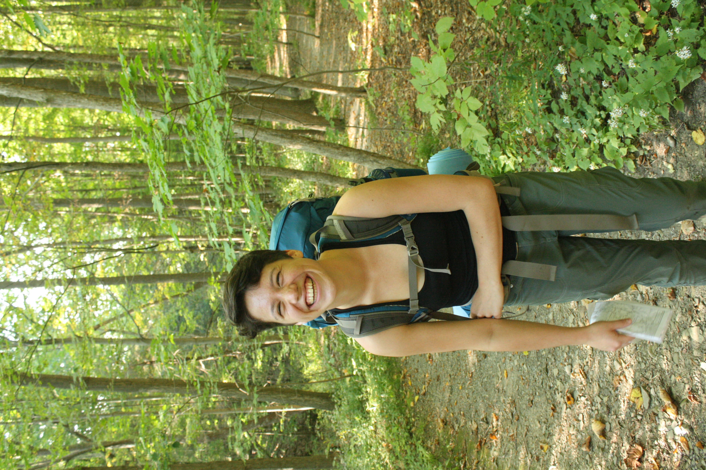

**My research focuses on the application of cutting-edge artificial intelligence methods in plant biology, with the aim of improving human life and sustainability.**

I first began research as an undergraduate at Cornell University, working with Georg Jander at the Boyce Thompson Intitute in Ithaca, NY. While pursuing a bachelor of arts in biochemistry, I worked in the lab and greenhouse on characterizing mutants in the benzoxazinoid pathway in maize, and characterizing pesticide uptake across maize inbred lines for my undergraduate honors thesis. However, after a summer NSF Research Experience for Undergraduates working with Robert VanBuren at Michigan State University on the genomics of facultative Crassulacean acid metabolism in succulents, I knew I'd been bitten by the programming bug. I took two computer science classes my senior year and applied to graduate school in plant biology. I've since joined the [Shiu Lab](https://shiulab.github.io/) at Michigan State, where I work on machine learning interpretability in biology and domain-specific knowledge graph reasoning - check out the [projects](../projects/) page for more info. I hope to pursue a career in which I am able to use applications of machine learning to improve sustainability and security in agriculture or biofuel feedstocks.

Alongside my degree in biochemistry, I also pursued Spanish language throughout my undergraduate career. After a year and a half living in Cornell University's [Language House](https://cornell.campusgroups.com/culh/home/), several undergraduate immersion courses, and a semester studying abroad in Sevilla, Spain, with the [CASA Sevilla program](https://casa.education/sevilla), I am proudly fluent in the Spanish language. I am always looking for opportunities to merge my dual academic interests, and in the past have participated in internship and coursework experiences in conservation biology and plant molecular diagnostics that combine scientific learning and teaching with immersive Spanish language experiences. I continue to search for academic and professional opportunities that will allow me to combine my work with my second language.

I'm proudly [\#BiInSci](https://twitter.com/hashtag/biinsci?ref_src=twsrc%5Egoogle%7Ctwcamp%5Eserp%7Ctwgr%5Ehashtag) and passionate about diversity and inclusion in the workplace. I recognize that I have unwittingly benefitted from systems of racism and oppression in the US, and am working to educate myself and become an effective co-conspirator against anti-Black racism. I have started conversations in my worklpace about how we as a lab can become effectively anti-racist, and am seeking to increase my engagement with anti-racism across all areas of my life. Professionally, I participate in MSU's [Alliance for Graduate Education and the Professoriate](https://grad.msu.edu/agep) (AGEP) organization, and am newly a part of [Queer In AI](https://sites.google.com/view/queer-in-ai/about?authuser=0). In addition to these organizations, I serve on a committee designing a new peer mentorship program for my department with the goal of increasing retention and improving the experience of URM students. 

In my spare time, I love rock climbing, backpacking, classical ballet, photography, and science fiction. The photos on all the pages on this site are ones I've taken! I split my free time between my sports, taking pictures, and looking for new female sci-fi authors to read.    
